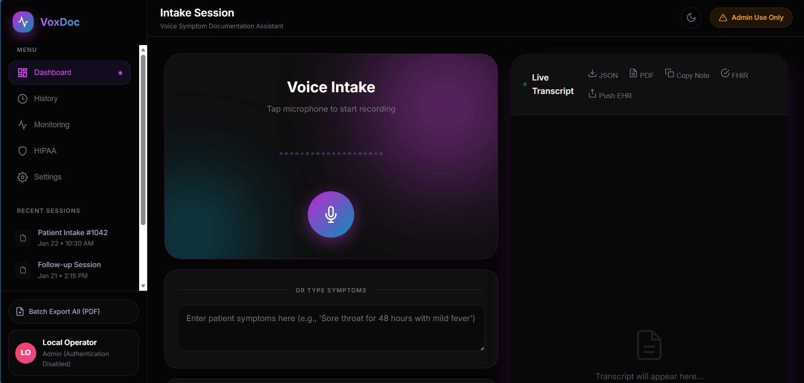
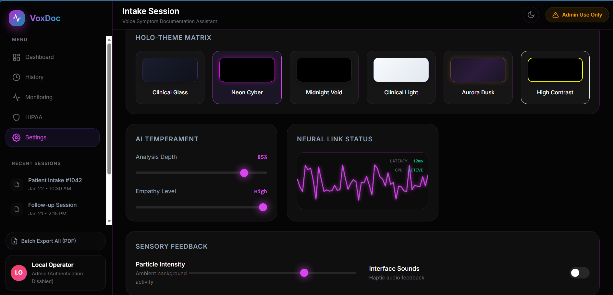
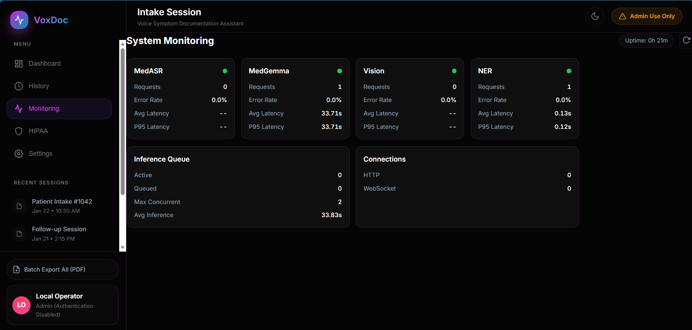
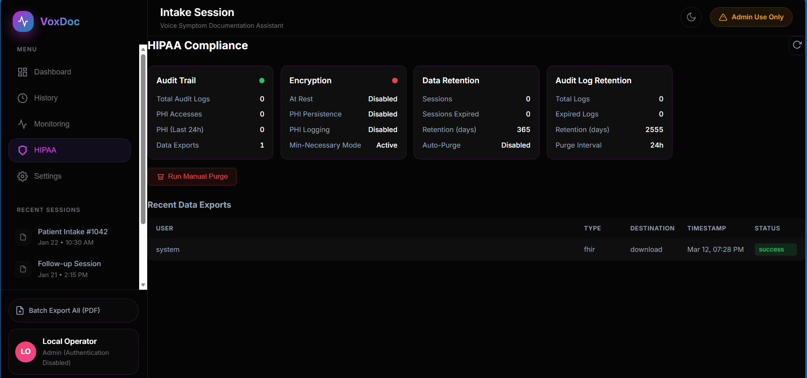
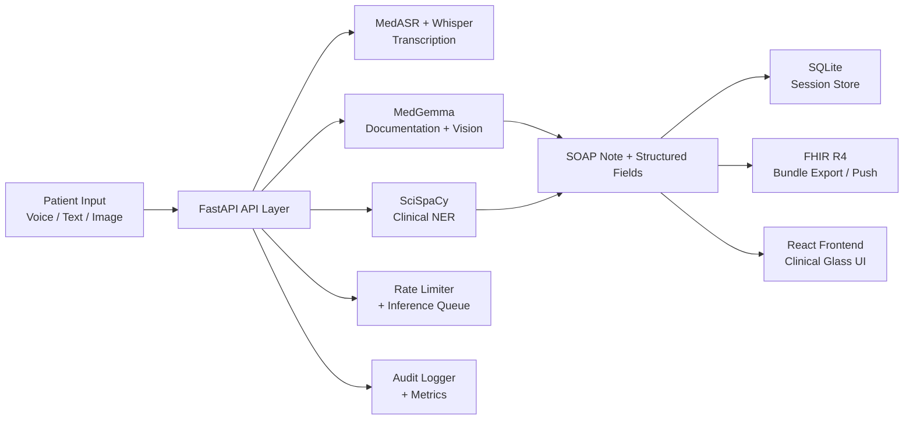

<div align="center">

# VoxDoc: Voice Symptom Documentation Assistant

**AI-powered voice intake and clinical documentation for modern healthcare workflows**

[](https://www.python.org/downloads/)
[](https://fastapi.tiangolo.com/)
[](https://react.dev/)
[](https://www.typescriptlang.org/)
[](https://huggingface.co/google/medgemma-1.5-4b-it)
[](https://hl7.org/fhir/R4/)
[](LICENSE)
[](#)

</div>

> [!IMPORTANT]
> VoxDoc is for **administrative documentation support only**.
> It does **not** provide diagnosis,  decisions, medical advice, or treatment plans.
> All generated content requires clinician review before use.

---

## Table of Contents

- [Overview](#overview)
- [Key Features](#key-features)
- [User Interface](#user-interface)
- [Architecture](#architecture)
- [Tech Stack](#tech-stack)
- [Project Structure](#project-structure)
- [Installation](#installation)
- [React Frontend](#react-frontend)
- [Configuration](#configuration)
- [Usage](#usage)
- [API Reference](#api-reference)
- [Deployment](#deployment)
- [Testing](#testing)
- [Recent Updates](#recent-updates)
- [Safety and Compliance](#safety-and-compliance)
- [Known Limitations](#known-limitations)
- [Roadmap](#roadmap)
- [Contributing](#contributing)
- [License](#license)

---

## Overview

VoxDoc transforms the patient intake process by converting voice, text, and image inputs into structured clinical documentation — reducing manual data entry burden for clinicians and intake staff.

The pipeline combines medical-grade ASR, a multimodal language model (MedGemma), and biomedical NER to produce SOAP notes, extract clinical entities, and export FHIR R4-compliant bundles ready for EHR integration — all within a HIPAA-aligned application framework.

The frontend is a fully-featured React 19 application with the **Clinical Glass** design system — a dark-mode glassmorphism UI with 6 themes, real-time WebSocket integration, and a complete SOAP note review workflow.

**Who this is for:** AI/ML engineers building healthcare tooling, clinical informatics teams exploring LLM automation, and developers evaluating medical AI pipelines.

---

## Key Features

| Area | Capability |
|---|---|
| **Voice Intake** | Upload-based and real-time WebSocket streaming transcription |
| **Medical ASR** | `google/medasr` for English clinical speech; `openai/whisper-small` as multilingual fallback |
| **Clinical Documentation** | MedGemma generates chief complaint, symptom details, and full SOAP notes |
| **Confidence Scoring** | Per-field reliability scores with green/yellow/red verification cues |
| **Image Analysis** | Optional MedGemma vision endpoint for visual findings description |
| **Biomedical NER** | SciSpaCy extracts conditions and medications from transcripts |
| **FHIR R4 Integration** | Build and push FHIR bundles to external EHR endpoints |
| **Session Persistence** | Save, list, retrieve, and delete intake sessions via SQLite |
| **HIPAA Compliance** | PHI redaction, AES-256-GCM encryption at rest, configurable data retention and auto-purge |
| **Audit Logging** | Structured access audit trail (user, resource, timestamp, status) |
| **Observability** | Prometheus-compatible metrics, structured JSON logging with correlation IDs |
| **Rate Limiting** | Sliding-window rate limiter + async inference queue with configurable concurrency |
| **Clinical Glass UI** | React 19 frontend — 87 components, 6 themes, glassmorphism design, WCAG 2.1 AA |
| **PWA** | Installable progressive web app with offline support and background sync |

---

## User Interface

| Dashboard | Settings Page |
| :---: | :---: |
|  |  |
| **Monitoring Dashboard** | **HIPAA Compliance** |
|  |  |

---

## Architecture



**Request lifecycle:**
1. Patient voice/text/image arrives at the FastAPI layer.
2. Audio is transcribed by MedASR (English) or Whisper (multilingual fallback).
3. The transcript is passed to MedGemma for structured SOAP generation.
4. SciSpaCy runs parallel NER to extract conditions and medications.
5. The combined output is persisted to SQLite and optionally exported as a FHIR R4 bundle.
6. The clinician reviews and approves the result in the React UI before any downstream action.

---

## Tech Stack

| Layer | Technology |
|---|---|
| **Backend** | FastAPI, Uvicorn, SQLAlchemy (async), aiosqlite |
| **AI / ML** | PyTorch, Hugging Face Transformers, `google/medasr`, `google/medgemma-1.5-4b-it`, `google/medgemma-4b-it`, `openai/whisper-small` |
| **Biomedical NLP** | SciSpaCy, `en_core_sci_sm`, `en_ner_bc5cdr_md` |
| **Audio Processing** | librosa, soundfile, noisereduce, torchaudio |
| **EHR Integration** | FHIR R4, httpx |
| **Security** | cryptography (AES-256-GCM), PBKDF2 password hashing |
| **Observability** | Prometheus-compatible metrics, structured JSON logging |
| **Frontend** | React 19, TypeScript 5.5, Vite 6, TailwindCSS 4, Zustand 5, TanStack Query 5, Framer Motion 11 |
| **UI Design** | Clinical Glass design system — glassmorphism, 6 themes, WCAG 2.1 AA |
| **Deployment** | Docker (CPU + GPU profiles), Google Colab notebook |
| **Config** | Pydantic Settings, python-dotenv |

---

## Project Structure

```text
voice-symptom-documentation-assistant/
├── app/
│   ├── main.py                    # FastAPI routes and app wiring
│   ├── config.py                  # Pydantic settings (all env vars)
│   ├── auth.py                    # Authentication helpers
│   ├── compliance.py              # HIPAA safeguards and PHI redaction
│   ├── encryption.py              # AES-256-GCM encryption at rest
│   ├── data_retention.py          # Retention policies and auto-purge
│   ├── rate_limiter.py            # Sliding-window rate limiter + inference queue
│   ├── metrics.py                 # Prometheus-compatible metrics and alerting
│   ├── logging_config.py          # Structured JSON logging with correlation IDs
│   ├── db/
│   │   ├── database.py            # Async SQLAlchemy engine and session
│   │   ├── models.py              # ORM models (sessions, audit logs)
│   │   └── crud.py                # Session CRUD operations
│   ├── models/
│   │   ├── medasr_service.py      # Medical ASR inference
│   │   ├── medgemma_service.py    # Documentation and vision inference
│   │   ├── ner_service.py         # SciSpaCy entity extraction
│   │   ├── fhir_service.py        # FHIR R4 bundle generation and push
│   │   └── streaming_asr.py       # WebSocket streaming session logic
│   ├── prompts/
│   │   └── documentation_prompts.py  # Prompt templates for MedGemma
│   ├── utils/
│   │   └── audio_handler.py       # Audio preprocessing utilities
│   └── static/                    # Legacy vanilla JS frontend (served at /)
│       ├── index.html
│       ├── css/
│       ├── js/
│       ├── service-worker.js
│       └── manifest.json
├── frontend/                      # React 19 Clinical Glass UI
│   ├── src/
│   │   ├── components/
│   │   │   ├── ui/                # 11 primitive components (GlassCard, Badge, Modal…)
│   │   │   ├── layout/            # AppLayout, Sidebar, Header, UserCard
│   │   │   ├── voice/             # VoiceCard, RecordButton, WaveformVisualizer…
│   │   │   ├── soap/              # SOAPSectionCard, EHRPushModal, NEREntities…
│   │   │   ├── conversation/      # ConversationPanel, ChatBubble, EntitySidebar…
│   │   │   ├── dashboard/         # StatCard, SystemHealthGrid
│   │   │   ├── monitoring/        # ModelStatusCard, QueueCard, AlertsList
│   │   │   ├── settings/          # ThemeSelector, AudioSettings, ModelSettings…
│   │   │   ├── session/           # SessionCard
│   │   │   └── auth/              # LoginOverlay, ConsentDialog, SessionTimeout
│   │   ├── pages/                 # 8 route-level pages (lazy-loaded)
│   │   ├── hooks/                 # 9 custom hooks (audio, WebSocket, auth, PWA…)
│   │   ├── stores/                # 5 Zustand stores (theme, auth, session…)
│   │   ├── types/                 # TypeScript types (api, soap, conversation, theme)
│   │   └── styles/
│   │       └── globals.css        # Clinical Glass CSS variables + 6 theme variants
│   ├── vite.config.ts             # Vite config with /api + /ws proxy to :8000
│   └── package.json
├── scripts/
│   ├── setup.ps1                  # Windows setup helper
│   └── setup.sh                   # macOS/Linux setup helper
├── test_data/                     # Sample inputs for manual testing
├── colab_deployment.ipynb         # One-click Google Colab deployment
├── Dockerfile
├── docker-compose.yml
├── requirements.txt
├── pyproject.toml
├── .env.example
└── main.py                        # Uvicorn entrypoint
```

---

## Installation

### Prerequisites

- Python 3.10+
- Node.js 18+ and npm (for the React frontend)
- FFmpeg
- A [Hugging Face account](https://huggingface.co/settings/tokens) with access approved for:
  - [`google/medasr`](https://huggingface.co/google/medasr)
  - [`google/medgemma-1.5-4b-it`](https://huggingface.co/google/medgemma-1.5-4b-it)
  - [`google/medgemma-4b-it`](https://huggingface.co/google/medgemma-4b-it)

### 1. Clone the repository

```bash
git clone https://github.com/JoelJohnsonThomas/voice-symptom-documentation-assistant.git
cd voice-symptom-documentation-assistant
```

### 2. Create a virtual environment

```bash
python -m venv .venv
```

**macOS / Linux:**
```bash
source .venv/bin/activate
```

**Windows (PowerShell):**
```powershell
.\.venv\Scripts\Activate.ps1
```

### 3. Install Python dependencies

```bash
pip install --upgrade pip
pip install -r requirements.txt
```

Install SciSpaCy biomedical models for full NER support:

```bash
pip install https://s3-us-west-2.amazonaws.com/ai2-s2-scispacy/releases/v0.5.3/en_core_sci_sm-0.5.3.tar.gz
pip install https://s3-us-west-2.amazonaws.com/ai2-s2-scispacy/releases/v0.5.3/en_ner_bc5cdr_md-0.5.3.tar.gz
```

> If SciSpaCy models are not installed, the NER service runs in limited mode.

### 4. Configure environment variables

```bash
cp .env.example .env   # macOS/Linux
```
```powershell
Copy-Item .env.example .env   # Windows
```

Edit `.env` and set at minimum:

```env
HF_TOKEN=your_huggingface_token_here
MEDGEMMA_TERMS_ACKNOWLEDGED=true   # After reviewing https://ai.google.dev/gemma/terms
```

See [Configuration](#configuration) for the full variable reference.

---

## React Frontend

The `frontend/` directory contains the **Clinical Glass** React 19 application — a full-featured replacement for the vanilla JS UI, built with TypeScript strict mode and compiled to static assets via Vite.

### Development

```bash
cd frontend
npm install
npm run dev        # Starts Vite dev server on http://localhost:5173
                   # Proxies /api and /ws to FastAPI on :8000
```

### Production build

```bash
cd frontend
npm run build      # Outputs to frontend/dist/
```

FastAPI can serve the built assets by mounting `frontend/dist/` as a static directory. The legacy vanilla JS UI remains available at `app/static/` until the React build is mounted.

### Frontend features

| Feature | Details |
|---|---|
| **Clinical Glass design system** | Dark navy theme (`#0f111a`), glassmorphism cards, backdrop-blur, gradient glows |
| **6 themes** | Glass (default), Light, Neon Cyber, Midnight Void, Aurora Dusk, High Contrast (WCAG AAA) |
| **Voice recording** | `useAudioRecorder` hook with real-time waveform visualizer and duration timer |
| **Real-time transcription** | WebSocket hook streams partial + final transcript tokens |
| **SOAP review workflow** | Approve / Reject / Edit / History per section with full edit-history restore |
| **Conversation panel** | Floating chat panel with entity sidebar and emergency detection |
| **EHR push modal** | HAPI / Epic / Cerner FHIR R4 presets with auth token |
| **Monitoring page** | Model latency, error rates, queue utilization, dismissable alerts |
| **HIPAA page** | Compliance checklist, real-time audit trail, 7-year retention display |
| **Settings** | Theme picker, audio config, model selection, accessibility toggles |
| **PWA** | Install prompt, offline support, service worker |
| **Code splitting** | All 8 pages lazy-loaded; main bundle ~96 KB gzipped |

---

## Configuration

Primary settings class: [`app/config.py`](app/config.py) — all variables can be set via `.env` or environment.

| Variable | Default | Purpose |
|---|---|---|
| `HF_TOKEN` | _(required)_ | Hugging Face authentication token |
| `MEDASR_MODEL` | `google/medasr` | Medical ASR model ID |
| `MEDGEMMA_MODEL` | `google/medgemma-1.5-4b-it` | Text documentation model ID |
| `MEDGEMMA_VISION_MODEL` | `google/medgemma-4b-it` | Vision model ID |
| `WHISPER_MODEL` | `openai/whisper-small` | Multilingual ASR fallback |
| `MULTILINGUAL_ASR_ENABLED` | `true` | Enable language detection and Whisper fallback |
| `DEVICE` | `cpu` | `cpu` or `cuda` |
| `ENABLE_GPU` | `false` | Toggle GPU usage |
| `MAX_AUDIO_DURATION_SECONDS` | `300` | Maximum audio input length |
| `AUDIO_SAMPLE_RATE` | `16000` | Audio processing sample rate (Hz) |
| `STREAMING_INTERVAL_SECONDS` | `2.0` | Partial ASR update interval for WebSocket |
| `ENABLE_IMAGE_ANALYSIS` | `true` | Enable the image analysis endpoint |
| `MAX_IMAGE_SIZE_MB` | `10` | Maximum uploaded image size |
| `MEDGEMMA_TERMS_ACKNOWLEDGED` | `false` | Must be `true` before MedGemma inference runs |
| `ENFORCE_MEDGEMMA_TERMS_ACKNOWLEDGEMENT` | `true` | Block inference until terms are acknowledged |
| `ALLOW_PHI_LOGGING` | `false` | Allow PHI in log output (keep `false` in production) |
| `ENABLE_PHI_PERSISTENCE` | `false` | Persist raw transcript text (keep `false` in production) |
| `ENCRYPTION_AT_REST_ENABLED` | `false` | AES-256-GCM encryption for stored data |
| `ENCRYPTION_MASTER_KEY` | _(change)_ | Master key for encryption KDF |
| `RETENTION_SESSIONS_DAYS` | `365` | Auto-purge intake sessions after N days (0 = keep forever) |
| `RETENTION_AUDIT_LOGS_DAYS` | `2555` | ~7 years — HIPAA minimum 6 years |
| `AUTO_PURGE_ENABLED` | `false` | Enable scheduled data purge |
| `AUDIT_LOGGING_ENABLED` | `false` | Enable structured API access audit log |
| `RATE_LIMITING_ENABLED` | `true` | Enable sliding-window rate limiter |
| `RATE_LIMIT_GENERAL_RPM` | `60` | General endpoint rate limit (req/min) |
| `RATE_LIMIT_INFERENCE_RPM` | `10` | Inference endpoint rate limit (req/min) |
| `QUEUE_MAX_CONCURRENT_INFERENCES` | `2` | Max parallel model inference tasks |
| `METRICS_ENABLED` | `true` | Enable Prometheus-compatible metrics |
| `STRUCTURED_LOGGING_ENABLED` | `true` | JSON-formatted logs with correlation IDs |
| `API_HOST` | `0.0.0.0` | Server bind address |
| `API_PORT` | `8000` | Server port |
| `LOG_LEVEL` | `INFO` | Logging verbosity |

---

## Usage

### Start the backend

```bash
python -m uvicorn app.main:app --host 0.0.0.0 --port 8000 --reload
```

### Start the React frontend (development)

```bash
cd frontend && npm run dev
```

Open the React UI at: **http://localhost:5173**
Open the legacy UI / API at: **http://localhost:8000**

> First startup downloads and caches model weights — this may take several minutes depending on your connection and hardware.

### Example workflow

1. Open the React UI and sign in.
2. Navigate to **Voice Assistant** and grant microphone access.
3. Click **Record** — words stream in real time via WebSocket transcription.
4. Stop recording — the pipeline processes through ASR → MedGemma → NER.
5. Review each SOAP section (Approve / Edit / Reject per field).
6. Optionally open the **Conversation** panel to ask follow-up questions.
7. Export as JSON, PDF, or FHIR R4, or push directly to an EHR endpoint.

### Sample API call

```bash
# Upload audio and receive transcription
curl -X POST http://localhost:8000/api/transcribe \
  -F "file=@patient_audio.wav"

# Generate SOAP documentation from a transcript
curl -X POST http://localhost:8000/api/document \
  -H "Content-Type: application/json" \
  -d '{"transcript": "Patient reports sharp chest pain for two days, worse on inspiration."}'
```

---

## API Reference

Full route implementation: [`app/main.py`](app/main.py)

| Method | Route | Description |
|---|---|---|
| `GET` | `/api/health` | Service and model readiness check |
| `POST` | `/api/transcribe` | Transcribe an uploaded audio file |
| `WS` | `/ws/transcribe` | Real-time streaming transcription |
| `POST` | `/api/document` | Generate structured documentation from transcript |
| `POST` | `/api/voice-intake` | End-to-end intake: audio → documentation |
| `POST` | `/api/analyze-image` | MedGemma vision description of an uploaded image |
| `POST` | `/api/sessions` | Save an intake session |
| `GET` | `/api/sessions` | List all saved sessions |
| `GET` | `/api/sessions/{session_id}` | Retrieve a specific session |
| `DELETE` | `/api/sessions/{session_id}` | Delete a session |
| `POST` | `/api/fhir/export` | Build a FHIR R4 bundle from session data |
| `POST` | `/api/fhir/push` | Push a FHIR bundle to an external EHR endpoint |
| `GET` | `/api/audit-logs` | Retrieve compliance audit records |
| `GET` | `/metrics` | Prometheus-compatible metrics endpoint |

Interactive API docs (auto-generated by FastAPI): **http://localhost:8000/docs**

---

## Deployment

### Docker (recommended for production)

**CPU:**
```bash
docker compose --profile cpu up --build
```

**GPU (requires NVIDIA runtime):**
```bash
docker compose --profile gpu up --build
```

Related files: [`Dockerfile`](Dockerfile), [`docker-compose.yml`](docker-compose.yml)

Platform-specific setup helpers:
- macOS/Linux: [`scripts/setup.sh`](scripts/setup.sh)
- Windows: [`scripts/setup.ps1`](scripts/setup.ps1)

### Google Colab

For rapid prototyping or GPU-accelerated testing without local hardware:

1. Open [`colab_deployment.ipynb`](colab_deployment.ipynb) in Google Colab.
2. Set `HF_TOKEN` in the notebook environment.
3. Run all cells — a public ngrok URL is generated automatically.
4. Test all endpoints via the public URL.

Troubleshooting guide: [`COLAB_TROUBLESHOOTING.md`](COLAB_TROUBLESHOOTING.md)

---

## Testing

```bash
# Database smoke test
python test_db.py

# MedGemma integration test (requires HF_TOKEN and model access)
python test_medgemma_integration.py
```

Sample inputs for manual testing are in [`test_data/`](test_data/).

---

## Recent Updates

| Commit | Change |
|---|---|
| `475383e` | **Clinical Glass React frontend** — 87 components, glassmorphism design system, 6 themes, SOAP review workflow, real-time voice/WebSocket, full dashboard |
| `c1d0c1c` | Phase 4 (Scale): K8s Helm charts, OpenTelemetry, ONNX edge runtime, vLLM serving, wake word detection, SOC 2/FDA compliance docs |
| `064f67a` | Phase 3 (Agentic): multi-agent orchestrator, tool schemas, ambient documentation, NATS event bus, gRPC protos, cross-session memory, LoRA fine-tuning |
| `6db479b` | Phase 2 (Intelligence): faster ASR, ML diarization, voice biometrics, specialty templates, UMLS coding, hallucination detection, confidence calibration |
| `98e2152` | Phase 1 (Foundation): security hardening, streaming LLM, architecture decomposition |

---

## Safety and Compliance

VoxDoc is designed with healthcare data sensitivity in mind:

- **Administrative use only** — no diagnostic or triage outputs are produced as final authority; clinician review is required for all generated content.
- **PHI minimum-necessary defaults** — PHI logging and PHI persistence are disabled by default; opt-in via environment variables.
- **PHI redaction** — regex-based redaction of SSNs, phone numbers, emails, DOBs, and MRNs before any logging.
- **Encryption at rest** — optional AES-256-GCM encryption of stored transcripts and SOAP notes via PBKDF2-derived keys.
- **Data retention** — configurable auto-purge for intake sessions and audit logs; audit logs default to 7-year retention (HIPAA minimum: 6 years).
- **API access auditing** — structured audit trail recording user identity, resource accessed, timestamp, and status code.
- **MedGemma terms gating** — inference is blocked until `MEDGEMMA_TERMS_ACKNOWLEDGED=true` is explicitly set, ensuring organizational review of [Google's MedGemma terms](https://ai.google.dev/gemma/terms).
- **Compliance notices** — all AI-generated responses include explicit non-diagnostic disclaimers.
- **Field-level confidence scoring** — each extracted SOAP field carries a calibrated confidence score with a green/yellow/red verification band to guide clinician review.
- **Clinician SOAP approval workflow** — the React UI requires explicit Approve / Reject per SOAP section with full edit history before any export or EHR push.

---

## Known Limitations

- `app/static/manifest.json` references `icon-192x192.png` and `icon-512x512.png`; the repository currently includes only `app/static/icon.svg`. PWA installation icons require generation.
- First startup may take several minutes while model weights are downloaded and cached.
- `google/medasr` access requires explicit Hugging Face model approval — join the waitlist if access is pending.
- Real-time WebSocket streaming is tuned for `STREAMING_INTERVAL_SECONDS=2.0` on GPU; CPU environments may need `4.0` or higher for stable throughput.
- The React frontend (`frontend/`) is not yet mounted in the FastAPI app as a static build — run `npm run dev` for development or configure a static mount of `frontend/dist/` for production.

---

## Roadmap

- [ ] Mount React `frontend/dist/` in FastAPI static handler to replace vanilla JS UI
- [ ] Role-based access control (RBAC) with `Admin`, `Clinician`, and `Intake Staff` roles re-enabled
- [ ] Multi-language support beyond Whisper fallback (dedicated multilingual clinical ASR)
- [ ] Batch session processing for high-volume intake environments
- [ ] Native SMART on FHIR OAuth2 integration for EHR launch context
- [ ] Fine-tuned SOAP generation with specialty-specific prompt profiles (ED, primary care, behavioral health)
- [ ] Audit log export to SIEM-compatible formats (CEF, JSON Lines)
- [ ] Integration test suite with mock EHR endpoints

---

## Contributing

Contributions are welcome. To get started:

1. Fork the repository and create a feature branch from `master`.
2. Follow existing code style — FastAPI service patterns, Pydantic models, async SQLAlchemy for the backend; React component patterns, Zustand stores, TypeScript strict mode for the frontend.
3. Add or update tests in `test_*.py` files for any new backend functionality.
4. Open a pull request with a clear description of the change and its motivation.

Please review [`NOTICE`](NOTICE) before contributing. By submitting a PR you agree that your contributions will be licensed under the project's Apache 2.0 license.

---

## Supplementary Guides

| Guide | Purpose |
|---|---|
| [`COLAB_TROUBLESHOOTING.md`](COLAB_TROUBLESHOOTING.md) | Fixing common Colab deployment issues |
| [`MEDGEMMA_FIXES.md`](MEDGEMMA_FIXES.md) | MedGemma model loading and inference issues |
| [`ALTERNATIVE_MODEL_LOADING.md`](ALTERNATIVE_MODEL_LOADING.md) | Using alternative or local model paths |
| [`CUDA_FIX.md`](CUDA_FIX.md) | Resolving CUDA/PyTorch compatibility issues |
| [`GPU_ACCELERATION.md`](GPU_ACCELERATION.md) | Configuring and benchmarking GPU inference |

---

## License

Apache License 2.0 — see [`LICENSE`](LICENSE) and [`NOTICE`](NOTICE) for details.
