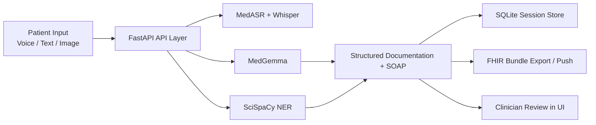

<div align="center">

# VoxDoc: Voice Symptom Triage Assistant

**AI-powered voice intake and clinical documentation support for healthcare workflows**

[](https://www.python.org/downloads/)
[](https://fastapi.tiangolo.com/)
[](LICENSE)
[](#)

</div>

> [!IMPORTANT]
> This system is for **administrative documentation support only**.
> It does **not** provide diagnosis, triage decisions, medical advice, or treatment plans.
> All outputs require clinician review.

## Table of Contents

- [Overview](#overview)
- [Feature Highlights](#feature-highlights)
- [Architecture Flow](#architecture-flow)
- [Tech Stack](#tech-stack)
- [Quick Start](#quick-start)
- [Google Colab](#google-colab)
- [Docker Run](#docker-run)
- [Configuration](#configuration)
- [API Surface](#api-surface)
- [Project Layout](#project-layout)
- [Testing](#testing)
- [Guides and Troubleshooting](#guides-and-troubleshooting)
- [Safety and Compliance](#safety-and-compliance)
- [Known Notes](#known-notes)
- [License](#license)

## Overview

VoxDoc captures patient symptom input through voice, streaming audio, text, and optional image uploads, then converts it into structured documentation.

The application combines:

- Medical ASR (`google/medasr`) for English speech
- Whisper fallback (`openai/whisper-small`) for language detection and multilingual handling
- MedGemma for structured documentation and SOAP generation
- SciSpaCy for condition/medication entity extraction
- FHIR R4 export/push for EHR workflows
- Session persistence with SQLite

## Feature Highlights

| Area | Capability | Implementation |
|---|---|---|
| Voice Intake | Upload-based transcription | `POST /api/transcribe` |
| Live Streaming | Real-time WebSocket transcription | `WS /ws/transcribe` |
| Documentation | Chief complaint + symptom details + SOAP | `POST /api/document`, `POST /api/voice-intake` |
| Reliability Scoring | Calibrated confidence per extracted field with verification bands | `documentation.field_confidence` |
| Image Support | Optional MedGemma vision description | `POST /api/analyze-image` |
| Clinical NER | Conditions and medications extraction | `app/models/ner_service.py` |
| Session History | Save/list/get/delete intake sessions | `/api/sessions*` |
| FHIR Integration | Build bundle and push to EHR endpoint | `/api/fhir/export`, `/api/fhir/push` |
| Frontend UX | PWA, themes, offline/install indicators | `app/static/*` |

## Architecture Flow



## Tech Stack

- Backend: [FastAPI](https://fastapi.tiangolo.com/), SQLAlchemy async, SQLite
- AI/ML: PyTorch, Transformers, Whisper, SciSpaCy
- Frontend: HTML, CSS, Vanilla JavaScript
- Deployment: Uvicorn, Docker (CPU/GPU profiles)

## Quick Start

### 1. Prerequisites

- Python 3.10+
- FFmpeg
- Hugging Face token with access to:
  - https://huggingface.co/google/medasr
  - https://huggingface.co/google/medgemma-1.5-4b-it
  - https://huggingface.co/google/medgemma-4b-it
- Token page: https://huggingface.co/settings/tokens

### 2. Setup Environment

```bash
git clone <your-repo-url>
cd voice-symptom-triage-assistant
python -m venv .venv
```

Windows (PowerShell):

```powershell
.\.venv\Scripts\Activate.ps1
```

macOS/Linux:

```bash
source .venv/bin/activate
```

### 3. Install Dependencies

```bash
pip install --upgrade pip
pip install -r requirements.txt
```

Install SciSpaCy model packages for full NER support:

```bash
pip install https://s3-us-west-2.amazonaws.com/ai2-s2-scispacy/releases/v0.5.3/en_core_sci_sm-0.5.3.tar.gz
pip install https://s3-us-west-2.amazonaws.com/ai2-s2-scispacy/releases/v0.5.3/en_ner_bc5cdr_md-0.5.3.tar.gz
```

### 4. Configure Environment

Copy and edit environment variables:

```powershell
Copy-Item .env.example .env
```

```bash
cp .env.example .env
```

Template: [`.env.example`](.env.example)

### 5. Run

```bash
python -m uvicorn app.main:app --host 0.0.0.0 --port 8000 --reload
```

Open: http://localhost:8000

## Google Colab

You can deploy and test this project directly in Google Colab using the included notebook:

- Notebook: [`colab_deployment.ipynb`](colab_deployment.ipynb)
- Troubleshooting: [`COLAB_TROUBLESHOOTING.md`](COLAB_TROUBLESHOOTING.md)

Recommended Colab workflow:

1. Open and run [`colab_deployment.ipynb`](colab_deployment.ipynb).
2. Set your `HF_TOKEN` in the notebook environment.
3. Use the generated public URL to test the web app and API endpoints.
4. Validate behavior with sample inputs (voice, text, and optional image upload).

## Docker Run

CPU profile:

```bash
docker compose --profile cpu up --build
```

GPU profile:

```bash
docker compose --profile gpu up --build
```

Related files:

- [`Dockerfile`](Dockerfile)
- [`docker-compose.yml`](docker-compose.yml)
- Windows helper: [`scripts/setup.ps1`](scripts/setup.ps1)
- macOS/Linux helper: [`scripts/setup.sh`](scripts/setup.sh)

## Configuration

Primary settings class: [`app/config.py`](app/config.py)

| Variable | Purpose |
|---|---|
| `HF_TOKEN` | Hugging Face authentication |
| `MEDASR_MODEL` | ASR model ID |
| `MEDGEMMA_MODEL` | Text model ID |
| `MEDGEMMA_VISION_MODEL` | Vision model ID |
| `WHISPER_MODEL` | Whisper fallback model |
| `MULTILINGUAL_ASR_ENABLED` | Enable language detect + fallback |
| `ENABLE_IMAGE_ANALYSIS` | Enable image analysis endpoint |
| `MAX_IMAGE_SIZE_MB` | Uploaded image limit |
| `DEVICE` | `cpu` or `cuda` |
| `ENABLE_GPU` | Toggle GPU usage |
| `MAX_AUDIO_DURATION_SECONDS` | Maximum input duration |
| `AUDIO_SAMPLE_RATE` | Audio processing sample rate |
| `STREAMING_INTERVAL_SECONDS` | Partial ASR update interval |
| `API_HOST`, `API_PORT`, `API_RELOAD` | Server config |
| `LOG_LEVEL` | Logging verbosity |
| `MEDGEMMA_TERMS_ACKNOWLEDGED` | Explicit MedGemma terms acknowledgement |
| `ENFORCE_MEDGEMMA_TERMS_ACKNOWLEDGEMENT` | Block MedGemma inference until acknowledged |
| `ALLOW_PHI_LOGGING` | Allow PHI-bearing logs (default `false`) |
| `ENABLE_PHI_PERSISTENCE` | Persist PHI-bearing session text (default `false`) |

## API Surface

Implementation source: [`app/main.py`](app/main.py)

| Method | Route | Purpose |
|---|---|---|
| `GET` | `/api/health` | Service/model readiness |
| `POST` | `/api/transcribe` | Audio file transcription |
| `POST` | `/api/document` | Structured documentation from transcript |
| `POST` | `/api/analyze-image` | Optional visual findings description |
| `POST` | `/api/voice-intake` | End-to-end intake (audio -> documentation) |
| `WS` | `/ws/transcribe` | Streaming transcription |
| `POST` | `/api/fhir/export` | Build FHIR R4 bundle |
| `POST` | `/api/fhir/push` | Push bundle to external FHIR/EHR server |
| `POST` | `/api/sessions` | Save intake session |
| `GET` | `/api/sessions` | List sessions |
| `GET` | `/api/sessions/{session_id}` | Retrieve session |
| `DELETE` | `/api/sessions/{session_id}` | Delete session |

## Project Layout

```text
app/
  main.py                 # FastAPI routes + app wiring
  config.py               # Pydantic settings
  db/
    database.py           # Async engine/session
    models.py             # Intake session ORM model
    crud.py               # Session CRUD operations
  models/
    medasr_service.py     # ASR service
    medgemma_service.py   # Documentation + vision service
    ner_service.py        # SciSpaCy entity extraction
    fhir_service.py       # FHIR bundle generation/push
    streaming_asr.py      # Streaming session logic
  prompts/
    documentation_prompts.py
  static/
    index.html
    css/style.css
    js/app.js
    service-worker.js
    manifest.json
scripts/
  setup.ps1
  setup.sh
```

## Testing

- DB smoke test: [`test_db.py`](test_db.py)
- MedGemma integration test: [`test_medgemma_integration.py`](test_medgemma_integration.py)
- Test-data notes: [`test_data/README.md`](test_data/README.md)

## Guides and Troubleshooting

- Colab notebook: [`colab_deployment.ipynb`](colab_deployment.ipynb)
- Colab troubleshooting: [`COLAB_TROUBLESHOOTING.md`](COLAB_TROUBLESHOOTING.md)
- MedGemma fixes: [`MEDGEMMA_FIXES.md`](MEDGEMMA_FIXES.md)
- Alternative model loading: [`ALTERNATIVE_MODEL_LOADING.md`](ALTERNATIVE_MODEL_LOADING.md)
- CUDA issue notes: [`CUDA_FIX.md`](CUDA_FIX.md)
- GPU acceleration notes: [`GPU_ACCELERATION.md`](GPU_ACCELERATION.md)

## Safety and Compliance

- Administrative support only
- No diagnostic/triage outputs as final authority
- Clinician review required for all generated content
- Compliance notices included in API responses
- HIPAA minimum-necessary defaults: PHI logging and PHI persistence disabled
- MedGemma terms acknowledgement gating before inference (enforced by default)
- Field-level extraction confidence scores with green/yellow/red verification cues

## Known Notes

- `app/static/manifest.json` references `icon-192x192.png` and `icon-512x512.png`, while the repository currently includes `app/static/icon.svg`.
- First startup can take time due to model downloads and warm-up.
- If SciSpaCy models are not installed, NER runs in limited mode.

## License

Apache License 2.0.

- [`LICENSE`](LICENSE)
- [`NOTICE`](NOTICE)
